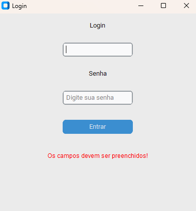

# Interface-de-Login-em-Python
Interface de login simples desenvolvida em Python com a biblioteca CustomTkinter, incluindo validação de usuário e senha.

🧰 Tecnologias
- Python 3
- CustomTkinter

🚀 Como executar
- pip install customtkinter
- python main.py

 | 

