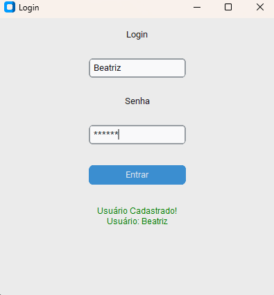

# Interface-de-Login-em-Python
Interface de login simples desenvolvida em Python com a biblioteca CustomTkinter, incluindo validação de usuário e senha.

💙 Funcionalidades
- Usuário e senha
- Mensagens de erro/verdes
- Interface clean

🧰 Tecnologias
- Python 3
- CustomTkinter

🚀 Como executar
1. pip install customtkinter
2. python main.py

 |  

